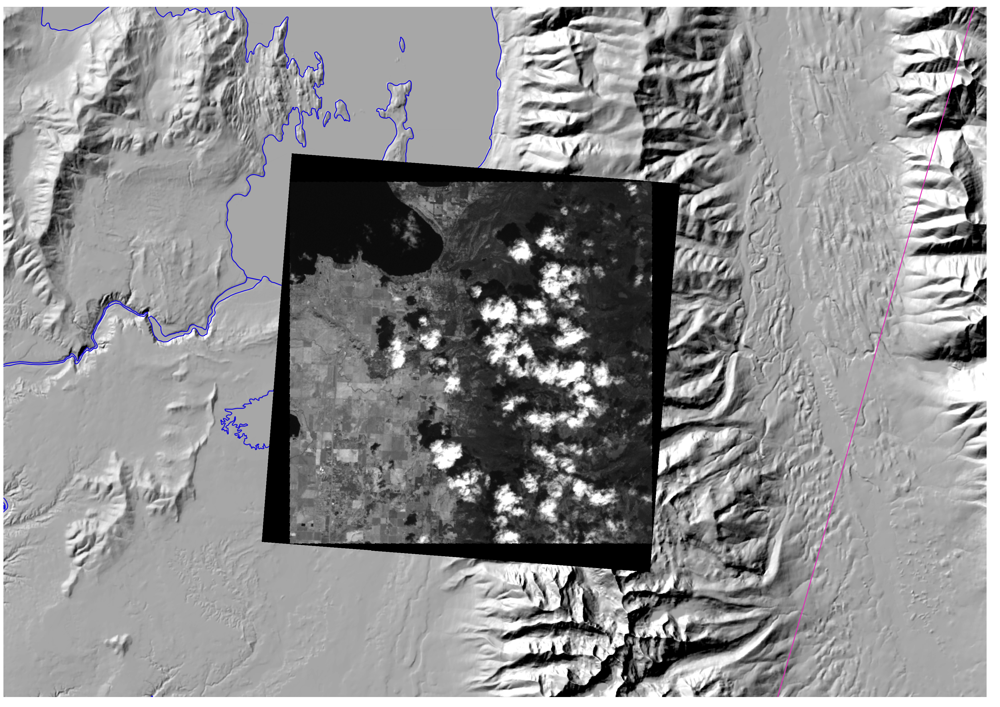

# 

# satellite_image
Provides a class to process images from various satellites, return: geographic information, 
cloud mask, reflectance, brightness temperature.

At this point, Landsat 5, 7, 8 (i.e., TM, ETM+, OLI, TIRS; a.k.a. LT5, LE7, LC8) are supported.  
Use [Landsat 578](https://github.com/dgketchum/Landsat578) to download and unzip an image based on 
the date and the location, pass the directory containing the unzipped package of files,
and get an object that full attributes, a bounding feature, and methods to return ndarrays 
 with all the information we want from Landsat:

- Fmask cloudmask, water mask, shadow mask, or combination mask.
- NDVI, NDSI; Normalized difference vegetation density, snow density.
- At-satellite brightness temperature for thermal bands.
- Reflectance for optical bands.
- Albedo using the method from Smith, currently working on Tasumi.
- Save any of these arrays as a GeoTiff.

Given this small section of a Landsat 7 image of the S. Flathead Lake and the 
Mission Mountians in Montana, band 5:

# 

